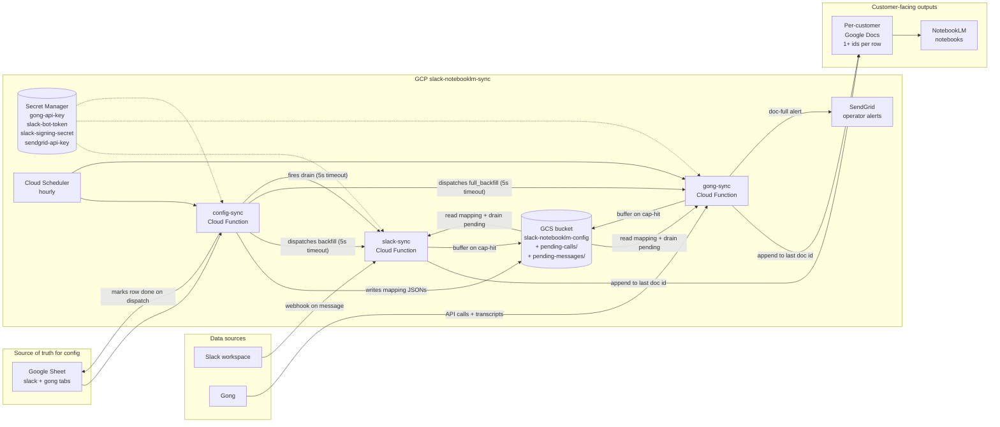

# NotebookLM Sync - Architecture

How the three services fit together, where data lives, and what runs when.
Written for someone who's never seen the repo before, and as a reference
when something breaks and you need to figure out "where is that data
coming from".

Everything runs in GCP project `slack-notebooklm-sync` in `us-central1`.

---

## The big picture



---

## The three services

All three live at the top level of this repo (`slack-sync/`, `gong-sync/`,
`config-sync/`) and share a common `shared/` module that's rsynced into
each service directory at deploy time.

### `shared/`

Six tiny helpers every service depends on:

- `shared.google_docs` - `get_docs_client()`, `get_doc_text(doc_id)`,
  `append_to_doc(doc_id_or_ids, content, current_text_bytes=None)`,
  `DocFullError`, `DOC_CAP_BYTES`. The append helper accepts either
  a single id (legacy) or a list of ids (multi-doc cap-hit flow);
  it always writes to the LAST id in the list and raises
  `DocFullError` when `current_text_bytes + len(content) > DOC_CAP_BYTES`
  (6 MB plaintext) **before** any API call.
- `shared.gcs_mapping` - `load_mapping(blob_name)` /
  `save_mapping(blob_name, mapping)` against the
  `slack-notebooklm-config` bucket, with a 5-minute per-blob in-memory
  cache. Sync services only read; config-sync is the sole writer.
- `shared.secrets` - `get_secret(name)` wrapping Secret Manager with
  in-process caching. Every credential comes from here - there are no
  `.env` files and no secret env vars on the functions.
- `shared.sheets` - `read_tab`, `write_cell`, `get_column_letter`,
  `batch_update_values`, plus `parse_id_list(cell_value)` for the
  comma-separated `document-id` / `Document ID` cells.
- `shared.pending` - GCS-backed FIFO buffer for calls/messages that
  hit a doc cap. API: `enqueue`, `list_partitions`, `count`, `drain`,
  `delete`. Layout is
  `gs://<bucket>/<prefix>/<partition>/<sortable-key>.json` where
  `prefix` is `pending-calls` (gong) or `pending-messages` (slack)
  and `partition` is the customer email-domain or channel id.
- `shared.alerts` - `send_doc_full_alert(...)`. SendGrid wrapper that
  NEVER raises. Optional `alerted_customers` set dedups within a run
  so an over-eager loop can't spam the same customer twice.

Because Cloud Functions can't import from a sibling path, each service's
`deploy.sh` does `rsync -a --delete ../shared/ ./shared/` before running
`gcloud functions deploy`. The in-service copies are gitignored; a trap
EXIT removes them after deploy. At dev time we use
`PYTHONPATH=.. functions-framework ...` from inside the service dir.

### `slack-sync`

Cloud Function, runtime `python312`, entry `slack_webhook`. Three modes
on the same HTTP endpoint:

- **Webhook mode (POST)**: Slack's Events API hits the function on
  every message in a channel the app is invited to. The function:
  1. Verifies the `v0=` HMAC (5 min replay window, signing secret
     from `slack-signing-secret`). Fails closed - there is no escape
     hatch.
  2. Drops any request with an `X-Slack-Retry-Num` header so Slack's
     3-second-retry behaviour doesn't double-append messages.
  3. Looks up `channel-mapping.json` in GCS (5-min cache), parses the
     `docId` cell with `parse_id_list` so `doc-old,doc-new` resolves
     to a list.
  4. Builds (or reuses) the per-channel concatenated dedup text. Cache
     key is `(channel_id, tuple(doc_ids))`; an operator extending the
     doc list invalidates the cache automatically on the next webhook.
  5. Resolves the user's display name via `users.info` (in-memory
     cache per instance, token from `slack-bot-token`).
  6. Appends `[ts] user:\n<text>\n\n` to the LAST doc in the list via
     `append_to_doc`. On `DocFullError` the message is buffered to
     `pending-messages/<channel_id>/<key>.json` in GCS. The webhook
     does **not** send a SendGrid alert - that would blow the 3s
     budget; the hourly drain does it instead.

- **Backfill mode (`GET ?backfill=true&channel=<id>[&oldest=<ts>]`)**:
  pages through `conversations.history`, reads the concatenated text
  of every doc in `parse_id_list(mapping['docId'])` for dedup, and
  appends new messages to the tail doc. `oldest` defaults to the
  channel's `created` timestamp via `conversations.info` so a fresh
  onboarding captures the entire history. On the FIRST `DocFullError`
  in this run the operator is alerted once via SendGrid; every
  subsequent message goes straight to GCS with no doc-side retry.

- **Drain mode (`GET ?drain=true`)**: walks every
  `pending-messages/<channel_id>/` partition that still has a
  current channel mapping, appends each buffered message to the tail
  doc, and deletes successful items from GCS. Stops on the first
  `DocFullError` per channel and fires one alert. Fired by config-sync
  at the end of every hourly run.

- **Sweep mode (`GET ?full_backfill_all=true`)**: dispatcher. Iterates
  the channel mapping and fires `?backfill=true&channel=<id>` at the
  function's own URL with a 5-second timeout, so each customer runs
  in its own 540s Cloud Function invocation. Returns immediately.

### `gong-sync`

Cloud Function, runtime `python312`, entry `gong_sync`. Triggered
hourly by Cloud Scheduler; also supports ad-hoc query params.

Modes:

- **Normal (`?hours=N`, default `2`)**: fetches calls in the last N
  hours via `GET /v2/calls`.
- **Backfill (`?backfill=true&days=N`, default `90`)**: fixed-window
  backfill of the last N days.
- **Full backfill (`?full_backfill=true&account=<domain>`)**: pulls
  the last 5 years of calls (well above Gong's typical 24-month
  retention) for one account.
- **Sweep (`?full_backfill_all=true`)**: dispatcher. Fires
  `?full_backfill=true&account=<domain>` at our own URL for every
  mapped account with a 5-second timeout. Returns immediately.

Every run starts by **draining** `pending-calls/<domain>/` for every
partition that has a current mapping. The drain reads the doc list's
fresh plaintext into a per-customer `customer_text_cache` and tries
to append each buffered call. On a `DocFullError` it alerts once and
stops draining that customer; remaining buffered items stay in GCS
until the next run after the operator extends the doc list.

After the drain, `process_calls`:

1. Calls `/v2/calls/extensive` in batches of 100 to get parties,
   context, and the brief summary.
2. For each call, extracts `(account_id, account_name)` from the CRM
   context or the external participant.
3. Optionally filters by `?account=<key>`.
4. Looks up the mapping in `account-mapping.json`. `find_mapping_for_account`
   now returns `(domain_key, mapping)` so the call has the GCS partition
   key (the email-domain) without re-querying.
5. Reads the customer's full doc list (`parse_id_list(mapping['docId'])`)
   into the shared cache and dedups against the concatenation. Dedup
   key remains `"GONG CALL: <title>"` plus the formatted
   `"%B %d, %Y at %I:%M %p"` date.
6. Fetches the transcript, formats it, and appends the whole block
   to the tail doc via `append_to_doc(doc_ids, ..., current_text_bytes=...)`.
   On `DocFullError` the formatted block is enqueued to
   `pending-calls/<domain>/` and one SendGrid alert is fired per
   customer per run.

After all calls complete, `_write_call_date_ranges` reads the FRESH
plaintext of every gong-tab row's doc list, extracts every call date
that follows the anchored three-line `GONG CALL:` header, and writes
the min/max as `MM/DD/YYYY` to the `first-call-recorded` /
`last-call-recorded` columns. This pass deliberately ignores the
in-process `customer_text_cache` because that cache contains text
from buffered (un-appended) calls; the date columns reflect what's
actually in the doc, not what's in flight.

There is no instance-local state file. Content-based dedup against
the doc list is the only mechanism.

Gong Basic-auth credentials come from the `gong-api-key` secret and
are base64-encoded on first use.

### `config-sync`

Cloud Function, runtime `python312`, entry `config_sync`. Triggered
hourly by Cloud Scheduler. Flow on every run:

1. Reads both tabs of the onboarding Google Sheet (`slack` and `gong`)
   via the Sheets API.
2. Rebuilds `channel-mapping.json` / `account-mapping.json` from the
   `Y`-flagged rows plus any new ones, writes them to the GCS config
   bucket only if the content actually changed.
3. For each row where `Config done (Y/N)` is blank **and** the key
   isn't already in the GCS mapping:
   - **Slack rows**: dispatches `?backfill=true&channel=<id>` to
     slack-sync (no `oldest` - slack-sync defaults to channel.created).
   - **Gong rows**: dispatches `?full_backfill=true&account=<domain>`
     to gong-sync.
   - All dispatches use a **5-second `requests` timeout**: a timeout
     is treated as success because the receiving function keeps
     running on its own 540s budget. Only DNS / connection errors
     mark the row as 'error' and leave `Config done` blank.
4. Marks `Config done = Y` on **dispatch** (not completion). The
   sync services are content-dedup idempotent so a repeated dispatch
   is safe.
5. At the end of every run, fires `?drain=true` at slack-sync. Cheap
   when there's nothing to drain; clears any buffered messages once
   the operator has extended the doc list.

There is no `Backlog through` / `backlog-through` math anywhere any
more. config-sync no longer fetches `conversations.info`, no longer
parses date strings, and no longer tries to choose a backfill window:
the sync services do.

---

## Data stores

### GCS bucket `slack-notebooklm-config`

Two mapping blobs (managed exclusively by config-sync) plus two
prefixes for buffered items:

- `channel-mapping.json` - `{ channel_id: { docId, customerName } }`.
  `docId` is a string; one or more comma-separated ids.
- `account-mapping.json` - `{ account_key: { docId, customerName } }`.
- `pending-calls/<email_domain>/<sortable-key>.json` - calls that
  hit `DocFullError` during a gong-sync run.
- `pending-messages/<channel_id>/<sortable-key>.json` - messages that
  hit `DocFullError` during a slack-sync webhook or backfill.

Pending payloads are JSON `{"id", "content", "meta"}` and are drained
in lexicographic key order (i.e. enqueue order within ms resolution).

### Secret Manager

| Secret | Consumer(s) | Format |
|---|---|---|
| `gong-api-key` | gong-sync | `accessKeyId:accessKeySecret` |
| `slack-bot-token` | slack-sync | `xoxb-...` |
| `slack-signing-secret` | slack-sync | hex string |
| `sendgrid-api-key` | gong-sync, slack-sync (via `shared.alerts`) | SendGrid API key |

All accessed via `shared.secrets.get_secret(name)`. The runtime
service account (`399790122111-compute@developer.gserviceaccount.com`)
needs `roles/secretmanager.secretAccessor` on each one.

In addition, both gong-sync and slack-sync read the `ALERT_EMAIL`
and `SENDGRID_FROM` env vars (set on `gcloud functions deploy
--update-env-vars=...`). Missing either disables the alert path
silently.

### The Google Sheet

[NotebookLM customer config](https://docs.google.com/spreadsheets/d/1p8CZ5RBGkFSf6aPnUIz8DXai9_UgNZhj7g1JtbPMvzI)
is the source of truth for which channels / accounts sync where. Two
tabs:

- `slack`: `Slack Channel ID`, `Document ID`, `Customer Name`,
  `Config done (Y/N)`.
- `gong`: `customer-email-domain`, `document-id`, `customer-name`,
  `Config done (Y/N)`, `first-call-recorded`, `last-call-recorded`.

`Document ID` / `document-id` cells hold a single id (`doc-abc`) or a
comma-separated list (`doc-abc,doc-def`). New content always lands
on the LAST id in the list; dedup runs against the concatenation of
all ids. `first-call-recorded` and `last-call-recorded` are managed
by gong-sync (do not hand-edit; overwritten on every run).

Migration from the old schema (one-time on this rollout):

1. **Remove** the `Backlog through` column from the `slack` tab.
2. **Remove** the `backlog-through` and `calls-scraped` columns from
   the `gong` tab.
3. **Add** `first-call-recorded` and `last-call-recorded` to the
   `gong` tab.

The columns are looked up by header name, so leaving the old columns
in place won't break anything - but the data won't be touched and
operators will get confused.

---

## Schedules

All driven by Cloud Scheduler in `us-central1`:

- `config-sync` - hourly. Pushes sheet changes to GCS, dispatches
  backfills for new rows, fires the slack drain.
- `gong-sync` - hourly. Default `?hours=2` so the lookback slightly
  overlaps the cadence in case of a missed run. Drains pending calls
  first.
- `slack-sync` is **not** scheduled - its hot path is Slack webhooks.
  Scheduler reaches it indirectly through config-sync's dispatched
  backfills and end-of-run drain.

---

## Cap-hit runbook

When a customer's Google Doc fills up (we cap at 6 MB plaintext to
stay well clear of Google's 10 MB hard wall):

1. SendGrid sends an email to `ALERT_EMAIL` with subject
   `[notebooklm] gong doc full for <Customer>` (or `slack`). Body
   includes the mapped doc ids and the current count of buffered
   pending items.
2. New calls/messages for that customer continue to land safely in
   `gs://slack-notebooklm-config/pending-{calls,messages}/<key>/`.
   No data loss.
3. The operator:
   - Creates a new Google Doc and shares it with
     `399790122111-compute@developer.gserviceaccount.com` as Editor.
   - Edits the customer's row in the onboarding sheet:
     `document-id` cell becomes `doc-old,doc-new`.
4. Within an hour:
   - config-sync rebuilds `account-mapping.json` (or
     `channel-mapping.json`) with the new doc list.
   - The next gong-sync run drains `pending-calls/<domain>/` to the
     new tail doc; the next config-sync run fires
     `slack-sync?drain=true` which drains
     `pending-messages/<channel_id>/`.
5. To force the drain immediately:
   - Slack: `curl ".../slack-sync?drain=true"`.
   - Gong: `curl ".../gong-sync?hours=2"` (drain runs at the start
     of every gong invocation, regardless of mode).

The alert is rate-limited to one per customer per run by the
`alerted_customers` set passed to `shared.alerts.send_doc_full_alert`.

---

## Onboarding runbook

1. Create a Google Doc. Share it with
   `399790122111-compute@developer.gserviceaccount.com` as Editor.
2. Add a row to the `slack` and/or `gong` tab of the onboarding sheet.
   Leave `Config done (Y/N)` blank.
3. (Slack only) Invite `@NotebookLM Sync` to the channel.
4. Either wait for the next hourly run or trigger config-sync by hand:
   ```bash
   curl "https://us-central1-slack-notebooklm-sync.cloudfunctions.net/config-sync"
   ```
5. config-sync uploads the updated mapping to GCS, fires the backfill
   dispatch (5-second timeout, fire-and-forget), and flips the row to
   `Y`. The actual backfill runs in its own slack-sync / gong-sync
   invocation with the full 540s budget. No data range to choose:
   slack-sync defaults `oldest` to `channel.created`, gong-sync's
   `?full_backfill` walks the entire Gong retention window.
6. Add the doc as a source in the customer's NotebookLM.

---

## One-time existing-customer sweep

After deploying this version for the first time, run the dispatcher
sweeps to backfill historical content into the new schema:

```bash
curl ".../slack-sync?full_backfill_all=true"
curl ".../gong-sync?full_backfill_all=true"
```

Both endpoints return immediately. The actual work parallelises one
Cloud Function invocation per mapped customer.

---

## Continuous integration

[`.github/workflows/ci.yml`](.github/workflows/ci.yml) runs on every push
and PR to `master`. One job, three checks (runs them all even if an
earlier one fails, so a single push surfaces every problem):

1. **`ruff check .`** - Pyflakes-only (`F` ruleset). `F821` catches
   undefined-name bugs at AST time. This is the check that would have
   caught the live regression where `import json` was dropped from
   `config-sync/main.py`.
2. **`TZ=UTC pytest`** - runs the `tests/` suite: Tier 0 import-smoke
   plus Tier 1 unit tests (see the tree under [tests/](tests)).
3. **`shellcheck deploy.sh slack-sync/deploy.sh gong-sync/deploy.sh
   config-sync/deploy.sh`** - catches quoting and unset-var mistakes
   in the deploy scripts.

Pytest runs under `importlib.util.spec_from_file_location` loaders in
[`tests/conftest.py`](tests/conftest.py). An autouse fixture poisons
real-IO boundaries (`shared.secrets.get_secret`,
`shared.gcs_mapping._get_client`, `shared.sheets.get_sheets_client`,
`shared.google_docs.get_docs_client`, `shared.pending._get_client`)
so a forgotten mock surfaces loudly rather than making real network
calls.

What CI does **not** cover today (all Tier 2 candidates):

- Orchestration code paths in `process_slack_tab` / `process_gong_tab`
  / `process_calls`. The "unconditional mark-Y" regression lived here.
- Behavioral tests of `deploy.sh` (argument forwarding, `shift`
  correctness). Shellcheck is only a syntactic/style linter.
- End-to-end tests against real Slack / Gong / GCS / Secret Manager.

---

## Deploying

`./deploy.sh slack|gong|config|all`. Each service's `deploy.sh`:

1. `rsync -a --delete ../shared/ ./shared/`
2. `gcloud functions deploy <service> --source=.` with
   service-specific runtime / entry point / memory / timeout.
3. Trap EXIT removes `./shared/` afterwards.

`.gcloudignore` in each service is standalone (no `#!include:.gitignore`)
and ends with `!shared/` to guarantee the rsynced copy uploads even
though `shared/` is gitignored inside the service dir.

Set `ALERT_EMAIL` and `SENDGRID_FROM` on gong-sync and slack-sync the
first time you deploy this version:

```bash
gcloud functions deploy gong-sync \
  --update-env-vars=ALERT_EMAIL=ops@yourcompany.com,SENDGRID_FROM=noreply@yourcompany.com
gcloud functions deploy slack-sync \
  --update-env-vars=ALERT_EMAIL=ops@yourcompany.com,SENDGRID_FROM=noreply@yourcompany.com
```

---

## Common failure modes

| Symptom | Likely cause | Where to look |
|---|---|---|
| "No mapping found for channel/account" | Sheet row missing or config-sync hasn't synced it yet | onboarding sheet, then `gsutil cat gs://slack-notebooklm-config/channel-mapping.json` |
| `403` / `caller does not have permission` on a doc | Doc not shared with `399790122111-compute@...` | doc's Share settings |
| "Invalid signature" on slack-sync | `slack-signing-secret` doesn't match the Slack app | Slack app "Basic Information" vs `gcloud secrets versions access latest --secret=slack-signing-secret` |
| `Failed to get credentials from Secret Manager` | SA missing `secretAccessor`, or secret renamed | Secret Manager IAM |
| gong-sync "skipped_accounts" entries | Gong labels the account differently than the sheet key | `gcloud functions logs read gong-sync`, find what Gong returned, add a row |
| Sheet row stuck on blank `Config done` after onboarding | Dispatch returned a connection error (DNS / IAM). The dispatch is fire-and-forget so a 5xx from the receiver doesn't block the `Y` flag. | Check `gcloud functions logs read config-sync` for `Failed to dispatch ...`; re-trigger config-sync once the underlying issue is fixed. |
| `[notebooklm] doc full` email | Customer's tail doc hit 6 MB. Calls/messages still safe in GCS pending. | See "Cap-hit runbook" above. |
| `first-call-recorded` / `last-call-recorded` blank | Either the columns are missing from the gong tab, the doc has no parseable headers yet, or this customer was dormant on the last run. | Add the column headers; confirm the doc has at least one `GONG CALL:` block; trigger `?full_backfill=true&account=<domain>` to reseed. |
| Pending-* objects piling up in GCS | Operator hasn't extended the customer's doc list yet, or the new doc isn't shared with the SA. | `gsutil ls gs://slack-notebooklm-config/pending-calls/` (and `pending-messages/`). Resolve per "Cap-hit runbook". |
| NotebookLM source stale | Doc is up to date; NotebookLM caches aggressively | re-index in the NotebookLM UI |

---

## Debugging commands

```bash
# All logs
gcloud functions logs read slack-sync  --region=us-central1 --project=slack-notebooklm-sync --limit=50
gcloud functions logs read gong-sync   --region=us-central1 --project=slack-notebooklm-sync --limit=50
gcloud functions logs read config-sync --region=us-central1 --project=slack-notebooklm-sync --limit=50

# What's currently in the GCS mappings
gsutil cat gs://slack-notebooklm-config/channel-mapping.json
gsutil cat gs://slack-notebooklm-config/account-mapping.json

# Pending queues (cap-hit buffers)
gsutil ls gs://slack-notebooklm-config/pending-calls/
gsutil ls gs://slack-notebooklm-config/pending-messages/

# Force a config-sync run now (also fires the slack drain at the end)
curl "https://us-central1-slack-notebooklm-sync.cloudfunctions.net/config-sync"

# Drain slack-sync immediately
curl "https://us-central1-slack-notebooklm-sync.cloudfunctions.net/slack-sync?drain=true"

# Backfill ONE Gong account, full retention
curl "https://us-central1-slack-notebooklm-sync.cloudfunctions.net/gong-sync?full_backfill=true&account=cadence.com"

# Sweep all existing customers (dispatcher; returns immediately)
curl "https://us-central1-slack-notebooklm-sync.cloudfunctions.net/slack-sync?full_backfill_all=true"
curl "https://us-central1-slack-notebooklm-sync.cloudfunctions.net/gong-sync?full_backfill_all=true"

# Rotate a secret
echo -n "<new-value>" | gcloud secrets versions add <name> \
  --data-file=- --project=slack-notebooklm-sync
```
