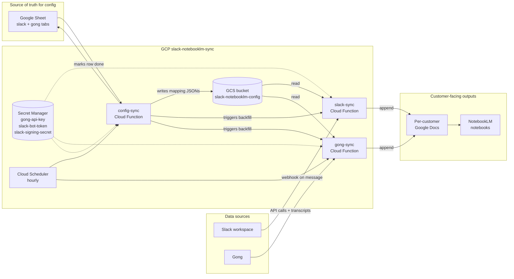

# NotebookLM Sync - Architecture

How the three services fit together, where data lives, and what runs when.
Written for someone who's never seen the repo before, and as a reference
when something breaks and you need to figure out "where is that data
coming from".

Everything runs in GCP project `slack-notebooklm-sync` in `us-central1`.

---

## The big picture



---

## The three services

All three live at the top level of this repo (`slack-sync/`, `gong-sync/`,
`config-sync/`) and share a common `shared/` module that's rsynced into
each service directory at deploy time.

### `shared/`

Three tiny helpers every service depends on:

- `shared.google_docs` - `get_docs_client()`, `get_doc_text(doc_id)`,
  `append_to_doc(doc_id, content)`. Google Docs API client cached in
  process, single "insert at end" pattern, plain-text reader for dedup.
- `shared.gcs_mapping` - `load_mapping(blob_name)` /
  `save_mapping(blob_name, mapping)` against the
  `slack-notebooklm-config` bucket, with a 5-minute per-blob in-memory
  cache. Sync services only read; config-sync is the sole writer.
- `shared.secrets` - `get_secret(name)` wrapping Secret Manager with
  in-process caching. Every credential comes from here - there are no
  `.env` files and no secret env vars on the functions.

Because Cloud Functions can't import from a sibling path, each service's
`deploy.sh` does `rsync -a --delete ../shared/ ./shared/` before running
`gcloud functions deploy`. The in-service copies are gitignored; a trap
EXIT removes them after deploy. At dev time we use
`PYTHONPATH=.. functions-framework ...` from inside the service dir.

### `slack-sync`

Cloud Function, runtime `python312`, entry `slack_webhook`. Two modes
on the same HTTP endpoint:

- **Webhook mode (POST)**: Slack's Events API hits the function on
  every message in a channel the app is invited to. The function:
  1. Verifies the `v0=` HMAC (5 min replay window, signing secret
     from `slack-signing-secret`). Fails closed - there is no escape
     hatch.
  2. Drops any request with an `X-Slack-Retry-Num` header so Slack's
     3-second-retry behaviour doesn't double-append messages.
  3. Looks up `channel-mapping.json` in GCS (5-min cache) to resolve
     channel -> doc.
  4. Resolves the user's display name via `users.info` (in-memory
     cache per instance, token from `slack-bot-token`).
  5. Appends `[ts] user:\n<text>\n\n` to the mapped Google Doc via
     `shared.google_docs.append_to_doc`.

- **Backfill mode (`GET ?backfill=true&channel=<id>&oldest=<ts>`)**:
  pages through `conversations.history`, reads the target doc once for
  dedup, and batches all new messages into a single append. Dedup key
  is the `[ts] user:` header - content-based, so repeated runs are
  idempotent. If `channel` is omitted, all mapped channels are
  processed in sequence.

### `gong-sync`

Cloud Function, runtime `python312`, entry `gong_sync`. Triggered
hourly by Cloud Scheduler; also supports ad-hoc query params.

Two modes:

- **Normal (`?hours=N`, default `2`)**: fetches calls in the last N
  hours via `GET /v2/calls`, then
- **Backfill (`?backfill=true&days=N`, default `90`)**: fetches calls
  in the last N days with pagination via `/v2/calls` + cursor.

Both modes converge on `process_calls`, which:

1. Calls `/v2/calls/extensive` in batches of 100 to get parties,
   context, and the brief summary.
2. For each call, extracts `(account_id, account_name)` from the CRM
   context or the external participant (`get_account_info_from_call`).
3. Optionally filters by `?account=<key>` for debugging.
4. Looks up the mapping in `account-mapping.json` (GCS, 5-min cache),
   matching account id first, then name (case-insensitive).
5. Reads the target doc once per doc (cache keyed by doc id), checks
   for `"GONG CALL: <title>"` + formatted date to dedup against prior
   runs.
6. Fetches the transcript (`/v2/calls/transcript`), formats it, and
   appends the whole block (header + AI summary + transcript).

There is no instance-local state file - the old
`/tmp/processed_gong_calls.json` didn't persist across instances and
was removed. Content-based dedup against the doc is the only mechanism.

Gong Basic-auth credentials come from the `gong-api-key` secret and are
base64-encoded on first use.

### `config-sync`

Cloud Function, runtime `python312`, entry `config_sync`. Triggered
hourly by Cloud Scheduler. Flow on every run:

1. Reads both tabs of the onboarding Google Sheet (`slack` and `gong`)
   via the Sheets API.
2. Rebuilds `channel-mapping.json` / `account-mapping.json` from the
   `Y`-flagged rows plus any new ones, writes them to the GCS config
   bucket only if the content actually changed.
3. For each row where `Config done (Y/N)` is blank **and** the key
   isn't already in the GCS mapping:
   - Slack rows: computes `oldest_ts` from the `Backlog through`
     column, or falls back to the channel's creation date (via
     `conversations.info` using `slack-bot-token`) capped at
     Jan 1 2024, then `curl`s slack-sync's backfill endpoint.
   - Gong rows: computes `days` since `backlog-through` or
     Jan 1 2024, then `curl`s gong-sync's backfill endpoint with
     `account=<customer-email-domain>` so gong-sync's per-call work
     is scoped to just this customer. Without the filter, gong-sync
     would dedup against every mapped customer doc and config-sync
     OOMs waiting for the response.
4. Writes `Y` back into `Config done (Y/N)` **only** for rows whose
   backfill HTTP call returned 200. Failed rows stay blank so the
   operator can see the problem - they do not auto-retry on the next
   run because the GCS mapping was already saved at step 2 and the
   new-row guard above filters them out. See "Sheet row stuck on
   blank" below.

---

## Data stores

### GCS bucket `slack-notebooklm-config`

Two blobs, both managed exclusively by config-sync:

- `channel-mapping.json` - `{ channel_id: { docId, customerName } }`
- `account-mapping.json` - `{ account_key: { docId, customerName } }`
  where `account_key` is usually an email domain (e.g. `cadence.com`)
  but can also be a Gong account id or name.

slack-sync and gong-sync read these through
`shared.gcs_mapping.load_mapping`, which caches each blob for 5 min.

### Secret Manager

| Secret | Consumer(s) | Format |
|---|---|---|
| `gong-api-key` | gong-sync | `accessKeyId:accessKeySecret` |
| `slack-bot-token` | slack-sync, config-sync | `xoxb-...` |
| `slack-signing-secret` | slack-sync | hex string |

All accessed via `shared.secrets.get_secret(name)`. The runtime
service account (`399790122111-compute@developer.gserviceaccount.com`)
has `roles/secretmanager.secretAccessor` on each one.

### The Google Sheet

[NotebookLM customer config](https://docs.google.com/spreadsheets/d/1p8CZ5RBGkFSf6aPnUIz8DXai9_UgNZhj7g1JtbPMvzI)
is the source of truth for which channels / accounts sync where. Two
tabs:

- `slack` - `Slack Channel ID`, `Document ID`, `Customer Name`,
  `Config done (Y/N)`, optional `Backlog through`.
- `gong` - `customer-email-domain`, `document-id`, `customer-name`,
  `Config done (Y/N)`, optional `backlog-through`.

Humans edit the sheet; config-sync does the rest.

---

## Schedules

All driven by Cloud Scheduler in `us-central1`:

- `config-sync` - hourly. Pushes sheet changes to GCS, backfills new
  rows, flips them to done.
- `gong-sync` - hourly. Default `?hours=2` so the lookback slightly
  overlaps the cadence in case of a missed run.
- `slack-sync` is **not** scheduled - its hot path is Slack webhooks.
  Scheduler only touches it indirectly, through config-sync backfills.

---

## Deduplication

Both sync services dedup by reading the target Google Doc's plain text
and skipping anything whose header already appears.

- **slack-sync** - header is `[mm/dd/yyyy, hh:mm AM/PM] <user>:`. The
  full text of the doc is read once per backfill, cached in memory
  across the batch, and every message we'd append is first checked for
  its header.
- **gong-sync** - header is `GONG CALL: <title>` plus the call's
  formatted date (`%B %d, %Y at %I:%M %p`). Both must be present before
  we count it as a dupe. Doc text is cached per doc id across a run.

Both append back into the cache so two calls on the same run that
share a doc don't double-append the second one.

---

## Deploying

`./deploy.sh slack|gong|config|all`. Each service's `deploy.sh`:

1. `rsync -a --delete ../shared/ ./shared/`
2. `gcloud functions deploy <service> --source=.` with
   service-specific runtime / entry point / memory / timeout.
3. Trap EXIT removes `./shared/` afterwards.

`.gcloudignore` in each service is standalone (no `#!include:.gitignore`)
and ends with `!shared/` to guarantee the rsynced copy uploads even
though `shared/` is gitignored inside the service dir.

---

## Adding a new customer

1. Create a Google Doc. Share it with
   `399790122111-compute@developer.gserviceaccount.com` as Editor.
2. Add a row to the `slack` and/or `gong` tab of the onboarding sheet.
   Leave `Config done (Y/N)` blank.
3. (Slack only) Invite `@NotebookLM Sync` to the channel.
4. Either wait for the next hourly run or trigger config-sync by hand:
   ```bash
   curl "https://us-central1-slack-notebooklm-sync.cloudfunctions.net/config-sync"
   ```
5. config-sync uploads the updated mapping to GCS, calls the backfill
   endpoint, and flips the row to `Y`.
6. Add the doc as a source in the customer's NotebookLM.

---

## Common failure modes

| Symptom | Likely cause | Where to look |
|---|---|---|
| "No mapping found for channel/account" | Sheet row missing or config-sync hasn't synced it yet | onboarding sheet, then `gsutil cat gs://slack-notebooklm-config/channel-mapping.json` |
| `403` / `caller does not have permission` on a doc | Doc not shared with `399790122111-compute@...` | doc's Share settings |
| "Invalid signature" on slack-sync | `slack-signing-secret` doesn't match the Slack app | Slack app "Basic Information" vs `gcloud secrets versions access latest --secret=slack-signing-secret` |
| `Failed to get credentials from Secret Manager` | SA missing `secretAccessor`, or secret renamed | Secret Manager IAM |
| gong-sync "skipped_accounts" entries | Gong labels the account differently than the sheet key | `gcloud functions logs read gong-sync`, find what Gong returned, add a row |
| Duplicate Slack messages | Should never happen now - retry-drop + header dedup both active | slack-sync logs for `"Ignoring Slack retry"` |
| Sheet row stuck on blank `Config done` after onboarding | Backfill returned non-200, or config-sync was killed before writing the cell. Mapping was saved before the backfill ran, so the next config-sync run skips it (`not in current_mapping` guard). | Check the relevant `gong-sync`/`slack-sync` logs for that customer, re-trigger the backfill manually with `?account=` (Gong) or `?channel=` (Slack), then flip the cell to `Y` by hand. |
| NotebookLM source stale | Doc is up to date; NotebookLM caches aggressively | re-index in the NotebookLM UI |

---

## Debugging commands

```bash
# All logs
gcloud functions logs read slack-sync  --region=us-central1 --project=slack-notebooklm-sync --limit=50
gcloud functions logs read gong-sync   --region=us-central1 --project=slack-notebooklm-sync --limit=50
gcloud functions logs read config-sync --region=us-central1 --project=slack-notebooklm-sync --limit=50

# What's currently in the GCS mappings
gsutil cat gs://slack-notebooklm-config/channel-mapping.json
gsutil cat gs://slack-notebooklm-config/account-mapping.json

# Force a config-sync run now
curl "https://us-central1-slack-notebooklm-sync.cloudfunctions.net/config-sync"

# Debug a single Gong account end to end
curl "https://us-central1-slack-notebooklm-sync.cloudfunctions.net/gong-sync?backfill=true&days=7&account=cadence.com"

# Rotate a secret
echo -n "<new-value>" | gcloud secrets versions add <name> \
  --data-file=- --project=slack-notebooklm-sync
```
